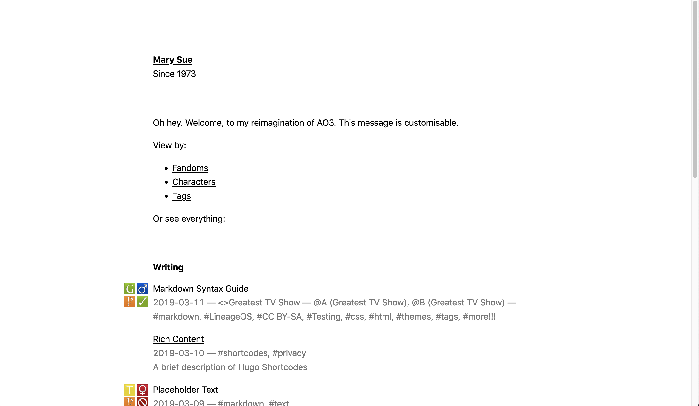
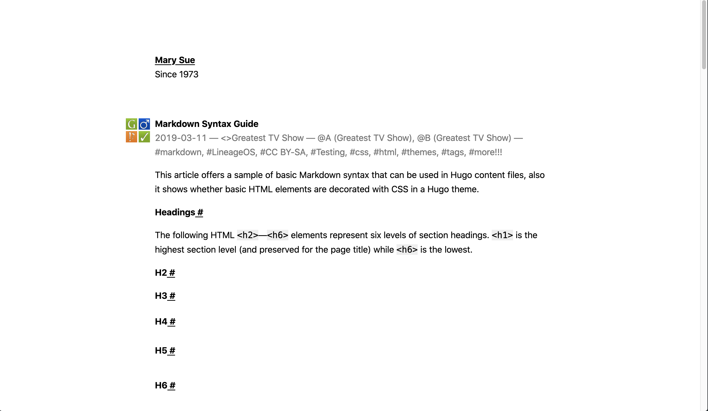

# Novelist Hugo theme

Novelist is content focused, minimal theme for Hugo, suitable for fanfiction writings. It aims at a feature set similar to [Archive of Our Own](https://archiveofourown.org/).

Demo: [https://simplist-hugo.netlify.app/](https://simplist-hugo.netlify.app/)





## Fork notes

### TODO

- Housekeeping
    + [x] Clean up temp files
    + [x] Add `theme.toml`
    + [x] Clean up layout code
    + [ ] Add i18n
    + [ ] Set up `exampleSite` \&\& deploy
- Style tweaks
    + [x] Centre the main tag
    + [x] Adjust date format
    + [x] Add rating system
    + [ ] Do something about the code fence styling
- New functionalities
    + [x] Add multi-chapter support
    + [ ] Add prev page next page buttons
    + [ ] Add archive pages
    + [x] More taxonomies \(fandoms, characters\)
    + [ ] Dark mode
    + [ ] Add jump to main button
    + [ ] Get the extra privacy version of the social shortcodes
    + [ ] Add searching
- Fix new bugs
    + [ ] Section permalink shenanigan
- ...

### Rating system

Icons: [otwarchive/public/images/skins/iconsets](https://github.com/otwcode/otwarchive/tree/master/public/images/skins/iconsets)

Copyright acknowledgement: `./exampleSite/content/rating-description.md`

You can choose from: \(Quotation marks are required. Can be single quote if you want.\)

- rating:
    + `"general-audience"`
    + `"teen"`
    + `"mature"`
    + `"explicit"`
    + `"no"`
- warning: 
    + `"choosenotto"`
    + `"yes"`
    + `"no"`
- category:
    + `"femslash"`
    + `"het"`
    + `"gen"`
    + `"slash"`
    + `"multi"`
    + `"other"`
    + `"no"`
- complete:
    + `"no"`
    + `"yes"`

YAML example:

```yaml
ratings:
  rating: "general-audience"
  warning: "choosenotto"
  category: "slash"
  complete: "yes"
```

TOML example:

```toml
[ratings]
rating = "teen"
warning = "choosenotto"
category = "femslash"
complete = "no"
```

## Features

- Minimalistic, clean and simple design
- Perfect for writers
- Content focused
- System fonts
- Anchor links
- NO JS!
- ~~AAA, 100/100 scores on Lighthouse, Gmetrix and Webpagetest~~
- Responsive design
- Tags and tag pages
- ~~Inline CSS~~
- Atom feed
- Json feed
- Related content (internal links)
- Sass
- SEO optimized (Twitter cards, Facebook Open Graph, Schema.org)

## Customisation

In `config.yaml`:

- `params.dateFormat` string: Enter any format of the date `Monday, Jan 2, 2006` that is compatible with [Go's Time Format function](https://pkg.go.dev/time#example-Time.Format). See [Hugo documentation](https://gohugo.io/functions/format/#hugo-date-and-time-templating-reference) for a list of simple examples.
- `params.showSummary` bool: Controls whether the article lists show the beginning of the article (140 words) or not.
- `params.lowVisionSymbols` bool: Controls whether to use the low vision version of ratings symbols or not.
